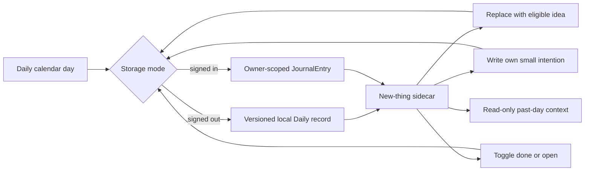

## Context

Daily already has one owner/day `JournalEntry` record, and signed-out Daily uses one versioned local record containing journals, habits, and habit logs. The new interaction belongs to that daily record rather than becoming a habit, commitment, or standalone progression system. See `proposal.md` for motivation and the capability specs for observable behavior.

## Goals / Non-Goals

**Goals:**

- Keep one stable, replaceable new-thing invitation attached to the current journal day.
- Let a person write the thing they already want to try instead of accepting a generated suggestion.
- Preserve identical interaction semantics across local and account storage modes.
- Make completion useful historical context without introducing scoring.
- Reuse the existing Side Quest corpus only where an activity is genuinely small and safe for a daily invitation.

**Non-Goals:**

- Personalized AI generation, notifications, reminders, streaks, or social sharing.
- Automatically modifying journal text, habits, commitments, or bucket-list progress.
- Guaranteeing a globally unique experience forever; the selector avoids recent repeats and may cycle after the eligible corpus is exhausted.

## Decisions

### Extend the per-day journal record

Add nullable `noveltyId`, nullable `noveltyText`, and boolean
`noveltyCompleted` fields to `JournalEntry`. A catalog suggestion uses its ID;
a person-authored choice uses trimmed text and no catalog ID. A default
suggestion can be derived without a write; the first replacement, custom choice,
or completion upserts the day’s journal record and preserves any existing
writing/context. This keeps one owner/day invariant and avoids a second
lifecycle table.

Alternative considered: a separate `DailyNovelty` table. Rejected because its ownership, day key, history navigation, local import, and retention would duplicate the journal’s existing structure.

### Derive from a bounded eligible corpus

Create a pure helper over first-party Side Quests that includes only activities with an explicit duration of one hour or less and excludes hard-difficulty items. Selection hashes the calendar day plus a stable mode seed, then avoids recently stored IDs where possible. “Another idea” deterministically advances to a different eligible candidate and stores that ID.

Alternative considered: use the full 300+ experience corpus. Rejected for this surface because many experiences require travel, money, planning, or long commitments and would contradict the small daily promise.

### Put action beside reflection

At desktop widths, the new-thing panel and journal form share one asymmetric two-column passage, with the journal remaining dominant. On mobile, the new thing appears immediately before the journal so the person encounters an action before reflecting. When browsing an earlier date, the panel becomes read-only and shows only stored history.

The custom-choice control expands inline inside the panel rather than opening a
modal. It accepts one item per line or a numbered pasted list and stores the
normalized lines in the existing text field. Daily derives a read-only,
newest-first "Things I've done" passage from completed per-day records; custom
lists expand into their individual items there. No aggregate score or second
persistence model is introduced.

### Make habits a checklist, not a dashboard

Daily habit rows share one quiet white field with separators. Each row is led by
a large reversible check target and the habit name; cadence and optional
commitment context are secondary. Weekly dots, progress bars, and streak badges
are removed because they compete with the act of checking in and contradict the
non-scoring Daily model. Creation and deletion remain available only in the
expanded Manage state.

### Let the wordmark own dashboard navigation

Authenticated `/` remains the default dashboard and current-day summary. The
SH wordmark is its persistent home control, so the desktop and mobile menus list
only Live More, Daily, and History. This removes a redundant “Today” section
without adding a `/dashboard` alias.

### Separate the public site from the private workspace

Public navigation may grow around editorial stories, the primary hobby quiz,
experience possibilities, the manifesto, and public profiles. The landing and
authenticated home/dashboard at `/` never force onboarding. Live More, Daily,
and History require completed onboarding. Account mode reads
`onboardingCompletedAt`; local mode reads the existing versioned
`onboarding:profile` record. The journey is named and routed as Onboarding, not
Setup.

### Preserve optimistic interaction with rollback

Replacement and completion update immediately, announce status through an `aria-live` region, and roll back on failure. Server actions verify suggestion IDs against the eligible corpus and owner-scope every update.

## Risks / Trade-offs

- [A short corpus eventually repeats] → Avoid recent stored IDs and keep selection logic data-driven so the eligible set can expand without schema changes.
- [A journal row may exist with no writing] → Existing journal queries already tolerate null AM/PM fields; history continues to treat writing and lived context separately.
- [Local import can create owner/day conflicts] → Keep account data authoritative and merge only missing novelty fields through the existing idempotent import path.
- [Suggestions feel like chores] → Use invitational copy, one primary action, reversible completion, and no progress metrics.

## Migration Plan

1. Add nullable novelty columns to the Drizzle source of truth and generate one additive D1 migration.
2. Apply and verify only against the isolated local D1 database.
3. Deploy code only after the operator applies the production migration; rollback leaves nullable columns and stored values intact.
