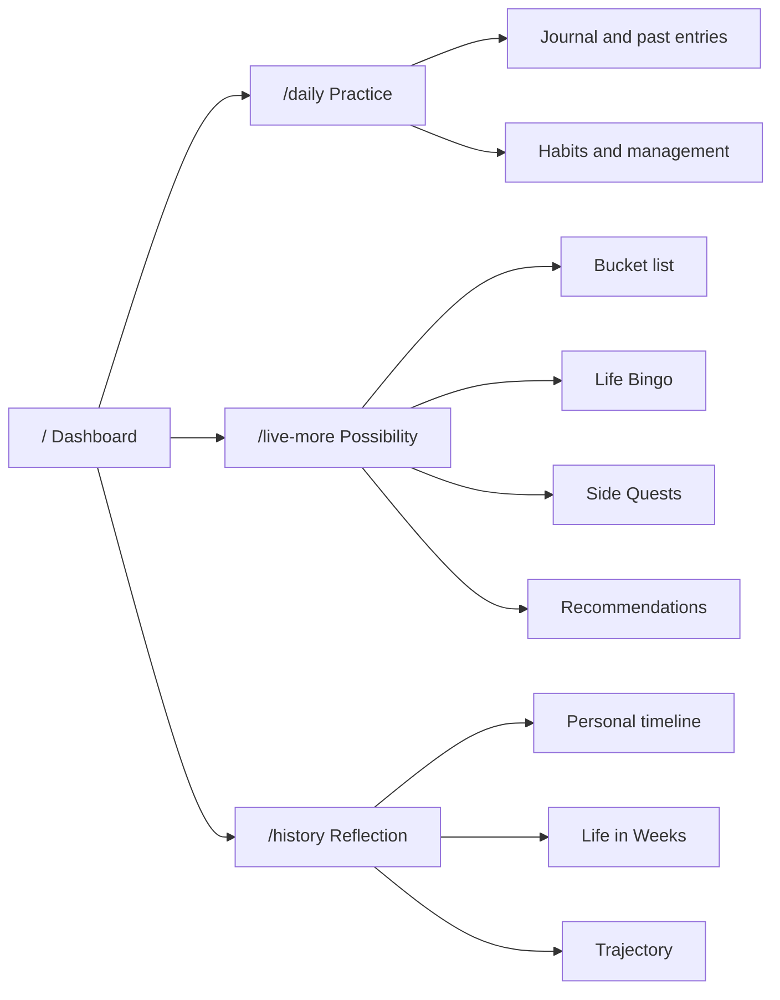

## Context

See `proposal.md` for motivation. The app already owns every required domain but exposes them through competing route names and separate feature entrances. Anonymous `/` is an Astro overlay; authenticated `/` is a Next server surface. Account data is owner-scoped in D1 and signed-out private work uses shared IndexedDB records.

## Goals / Non-Goals

**Goals:**

- Give each private destination one stable human question.
- Reuse existing domain models and focused editors while making the four homes feel complete.
- Make onboarding emotionally compelling, useful, resumable, and excellent at 390, 768, and 1440 pixels.
- Keep writes private by default and idempotent across retry or reload.

**Non-Goals:**

- No separate monthly goal system, social feed, habit score, autoplay video, or new production dependency.
- No deletion of deep public SEO routes or existing focused tools.
- No automatic publication of timelines, bucket-list items, Trajectory, journals, or habits.

## Decisions

### Make four canonical private destinations

The authenticated information architecture is:

`/life-plan`, `/look-back`, and `/dashboard` are removed. Deep editors remain available but stop competing in the global shell. With no external legacy users, keeping aliases would add ambiguity without preserving meaningful traffic.

### Make Today an action queue, not an analytics dashboard

The root queries bounded owner state: birth date/time framing, today's journal state, active habits and logs, one next bucket-list item, and a rotating editorial quote. It links into focused surfaces rather than reproducing their histories or managers.

### Make Live More an orchestration surface

`/live-more` is first an owned-list workspace: the person sees their existing bucket items, can add another without navigating away, and can turn a current item into a relevant Side Quest. Yearly goals remain context, while corpus-backed discovery follows the owned-list and Side Quest actions rather than competing with them for the first viewport. Discovery uses onboarding interests, active goals, prior dismissals, time/energy constraints, and existing saved items where available, and returns varied possibilities with a short fit explanation. Existing data sources remain authoritative; Live More is the coherent overview, not a new aggregate model.

Public discovery remains broad inspiration and SEO. Personalized ranking, negative feedback, and action conversion stay private inside the product. A static handful of generic cards was rejected because it would not help a person understand the breadth of possible lives.

### Keep Daily operational and History reflective

Daily owns present and recent practice: writing, journal history, habit check-ins, management, and humane continuity context. History owns autobiographical and directional reflection: personal timeline, Life in Weeks, life-so-far narrative, and Trajectory. The journal may be visible in Daily history without making it public or converting it into proof.

### Onboard from meaning to action

The journey uses seven short stages: identity/DOB; skippable quote or visual; remembered hobbies; searchable desired experiences from 5,000+ curated and structured hobby paths plus free entry or numbered-list paste; one-or-more independently entered yearly goals with bucket items available only as optional inspiration; an optional daily habit; initial Trajectory. The selected yearly goals collectively become Trajectory intent, so the final step asks for present constraints instead of making the person restate direction. Google name is prefilled but editable. The user may move back, skip optional inspiration, and resume a local draft. The final write boundary reuses owner-scoped actions and deduplicates initial state.

Monthly goals were rejected because they introduce planning administration before the user has experienced value. A small set of yearly goals is enough structure; later planning belongs inside Live More. A mandatory daily habit was also rejected because episodic goals such as a trip do not honestly map to daily repetition.

### Preserve the approved Life Atlas system with mobile-specific composition

This is a `preserve` design pass using the approved warm daylight Life Atlas: large flat color regions, editorial serif landmarks, candid imagery, dark ink, atlas gold for chosen direction, and sage for lived evidence. Desktop can be asymmetric. Mobile uses a deliberate vertical route, sticky or compact action placement, 44px targets, no horizontal card dependence, and the same semantic order rather than scaled-down desktop grids.

Music uses a visible privacy-enhanced YouTube embed with three upbeat choices and remembers the person's selection locally. It attempts playback when browser policy permits and keeps the native player available for the one-tap fallback browsers often require. Stopping music removes the embed. The interface states that the song streams from YouTube rather than implying on-device playback. Any separate visual video is muted, short, optional, and must have a static poster and reduced-motion fallback.

## Risks / Trade-offs

- [Compatibility links fragment navigation] → Redirect old overview routes server-side and replace internal destinations with canonical routes.
- [Onboarding becomes long again] → Keep each step to one decision, show progress, permit optional skips, and defer monthly planning and publishing.
- [Today becomes another dashboard] → Limit it to current actions and one next item; histories and managers remain one tap away.
- [Mobile color and density hurt readability] → Validate at 390/768/1440, enforce WCAG AA, and avoid horizontal-only interaction.
- [Exact DOB write reaches production before migration] → Keep the migration additive and require operator-owned migration before deployment.

## Migration Plan

1. Add canonical routes, remove obsolete overview routes, and retain useful deep editors.
2. Move internal links and onboarding completion to the four-surface model.
3. Verify account and local completion paths against the additive local schema only.
4. Run focused unit, lint, type, build, accessibility, and responsive browser checks.
5. Leave production migration and deployment to the operator.
